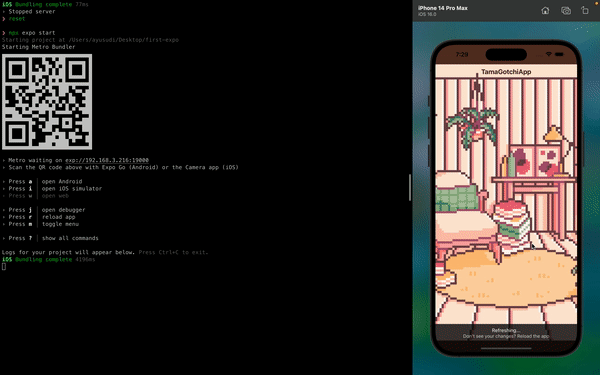

# React Native : Styling & Gestrure Handler

- [StyleSheet](https://reactnative.dev/docs/stylesheet)
- [React Native Gesture Handler](https://docs.swmansion.com/react-native-gesture-handler/)
  - Installation
  - Implementation Test Cae
    - Tap
    - Pinch
    - Composing Gesture  
      Demo: combine both of gesture with Exclusive.

# Tamagotchi App

### Style Information

- Color
  - Background SafeArea : `#5C3526`
  - Text Color : `#42261C`
- Asset
  - Character  
    https://static.wikia.nocookie.net/tamagotchi/images/e/e5/Mametchi_standing.png/revision/latest?cb=20220714103055
  - Background Image : Local file png `./assets/bg.png`

## Other Mentionable Topic

- SafeArea
- Alert
- Image
- ImageBackground.
- Source image from path and local file.
- Style `object-fit` in RN is `resizeMode`
